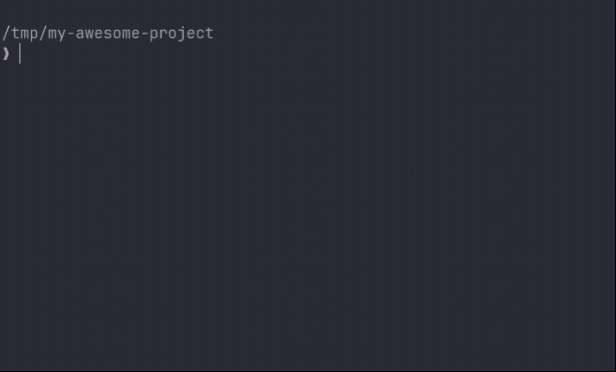

# claude-vm

QEMU sandbox for [Claude Code](https://docs.anthropic.com/en/docs/claude-code). Run Claude Code with full permissions in an isolated VM, with near-native filesystem performance via virtiofs.



## Why

Claude Code works best with `--dangerously-skip-permissions`, but running an AI agent with unrestricted access to your host is a reasonable concern. claude-vm gives Claude Code a full Linux environment with sudo, network access, and every tool it needs -- inside a VM that can't touch your host filesystem outside the project directory.

- **Isolated**: QEMU VM with KVM acceleration. Claude Code can `rm -rf /` and your host is fine.
- **Fast**: virtiofs gives near-native filesystem performance. No copying files in or out.
- **Lightweight**: Linked QCOW2 snapshots share a base image. Each project adds only its delta (~200KB initially).
- **Multi-instance**: Run multiple Claude Code sessions in the same project VM simultaneously.
- **Batteries included**: Git identity, GitHub CLI auth, and Claude Code config are synced automatically.

## Requirements

- Linux with KVM support (`/dev/kvm` accessible)
- QEMU (`qemu-system-x86_64`, `qemu-img`)
- virtiofsd
- `newuidmap` / `newgidmap` — virtiofsd uses them to build its user namespace
  when run unprivileged (Debian/Ubuntu: `uidmap` package; elsewhere part of `shadow`)
- An ISO creation tool (`genisoimage`, `mkisofs`, or `xorrisofs`)
- curl, rsync, jq

### Install dependencies

**Arch / CachyOS:**
```bash
sudo pacman -S qemu-full virtiofsd cdrtools curl rsync jq
```

**Ubuntu / Debian:**
```bash
sudo apt install qemu-system-x86 qemu-utils virtiofsd genisoimage curl rsync jq uidmap
```

**Fedora:**
```bash
sudo dnf install qemu-system-x86 qemu-img virtiofsd genisoimage curl rsync jq shadow-utils
```

## Install

```bash
curl -fsSL https://raw.githubusercontent.com/shudza/claude-vm/master/install.sh | bash
```

### Install from source

```bash
git clone https://github.com/shudza/claude-vm.git
cd claude-vm
sudo make install
```

This installs `claude-vm` to `/usr/local/bin/` and library scripts to `/usr/local/lib/claude-vm/`. To uninstall: `sudo make uninstall`.

To install elsewhere: `make install PREFIX=/opt/claude-vm`

For development, run directly from the repo (no install needed):

```bash
./claude-vm
```

## Quick Start

```bash
cd ~/my-project
claude-vm
```

First run builds a base image (about a minute plus the cloud image download), creates a project snapshot, and launches the VM. Subsequent runs resume in seconds.

## Commands

| Command | Description |
|-|-|
| `claude-vm [-- ARGS...]` | Launch sandbox and enter Claude Code |
| `claude-vm launch [DIR] [-- ARGS...]` | Launch sandbox for a specific directory |
| `claude-vm build [--flavor X]` | Build (or rebuild) the base image |
| `claude-vm ssh` | Shell into the running VM |
| `claude-vm stop [--all]` | Stop the VM (preserves snapshot) |
| `claude-vm reset` | Reset project snapshot to fresh state |
| `claude-vm rebase [--force] [--yes]` | Rebuild base, migrate VM state |
| `claude-vm destroy [--all]` | Remove sandbox artifacts (current project, or all with `--all`) |
| `claude-vm list` | List all project snapshots |
| `claude-vm status` | Show current project status |
| `claude-vm show` | Print the full QEMU and SSH commands for this project |
| `claude-vm config` | Show/set configuration |
| `claude-vm help` | Show help |

See [docs/usage.md](docs/usage.md) for the full reference with all flags and examples.

## Configuration

```bash
claude-vm config set VM_RAM 8G
claude-vm config set VM_CPUS 4
claude-vm config set FLAVOR debian-slim
claude-vm config set VM_USER alice
claude-vm config set SSH_PORT_BASE 10022
claude-vm config set FORWARD_PORTS "8080,3000:3000"   # per-project
claude-vm config set CLAUDE_ARGS "--dangerously-skip-permissions --model sonnet"
claude-vm config set REBASE_BACKUP_PATHS "/etc/ssh,~/.ssh"   # extra paths kept through rebase
```

Or edit directly:

```bash
# ~/.claude-vm/config
FLAVOR="debian-slim"
VM_USER="alice"
VM_RAM="8G"
VM_CPUS="4"
SSH_PORT_BASE="10022"
CLAUDE_ARGS="--dangerously-skip-permissions --model sonnet"
```

Environment variables override config: `VM_RAM=16G claude-vm`. `FORWARD_PORTS` is stored per project (sidecar file), see [docs/usage.md](docs/usage.md#port-forwarding) for spec formats.

## Flavors

Every distro comes in two variants: **slim** (fast to build — git, Node.js, Python, gh, and core tools) and **full** (slim plus build tools, tmux, vim, and debug utilities). Bare distro names (`debian`, `ubuntu`, ...) alias to the `-full` variant for backward compatibility.

| Flavor | Base Image | Notes |
|-|-|-|
| `debian-slim` (default) | Debian 13 (trixie) genericcloud | Minimal, no snapd |
| `debian-full` | Debian 13 (trixie) genericcloud | Adds build-essential, cmake, tmux, ... |
| `ubuntu-slim` / `ubuntu-full` | Ubuntu 24.04 minimal | snapd auto-removed |
| `archlinux-slim` / `archlinux-full` | Arch Linux cloud image | Rolling release, uses pacman |
| `fedora-slim` / `fedora-full` | Fedora 41 Cloud Base | Uses dnf |

```bash
claude-vm build --flavor debian-full
claude-vm build --flavor ubuntu-slim
claude-vm build --flavor fedora-slim
claude-vm build --flavor ubuntu        # alias for ubuntu-full
```

Each flavor gets its own base image (`~/.claude-vm/base/base-<flavor>.qcow2`), so multiple flavors coexist — different projects can use different flavors side by side.

## How It Works

1. **Base image** is built once: downloaded cloud image is verified against the upstream checksum file (SHA256/SHA512), then cloud-init provisions Claude Code, dev tools, and SSH
2. **Linked snapshots** (QCOW2 copy-on-write) give each project its own VM state backed by the shared base
3. **virtiofs** mounts your project directory into the VM at `/workspace` with near-native I/O
4. **Config sync** (rsync) copies your Claude Code settings, git identity, and gh auth into the VM on first VM creation
5. **SSH** connects your terminal to Claude Code running inside the VM

A base image is roughly 1–1.5GB depending on variant (each flavor keeps its own `base-<flavor>.qcow2`). Each project snapshot starts at ~200KB and grows only as the VM writes to its own disk (package installs, caches, etc.). QEMU is configured with `discard=unmap` so that deleted files are reclaimed from the overlay via fstrim, keeping snapshots compact over time. Background services that would silently grow snapshots (unattended-upgrades, apt timers, man-db rebuilds) are disabled during provisioning.

See [docs/architecture.md](docs/architecture.md) for the full design.

## Pre-installed Tools

All packages come from the distro's own repositories and install in a single cloud-init transaction — no third-party apt repos.

**Slim** (every flavor): git, ripgrep, jq, less, gh (GitHub CLI), curl, zip/unzip, rsync, Node.js + npm, Python 3 (with pip and venv), uv (Python package manager), Claude Code.

**Full** adds: build tools (build-essential/base-devel/gcc + cmake), tmux, vim, tree, xxd, file, sqlite3, bc, ping, lsof, socat, netcat, dig, strace, patch, wget, gnupg.

Node.js comes from the distro repos: 20.x on Debian 13, 18.x on Ubuntu 24.04, current releases on Arch and Fedora. Need something newer? Claude Code has full sudo access — install it at runtime via NodeSource or nvm, like any other missing tool.

## Multiple Instances

Open multiple terminals in the same project directory and run `claude-vm` in each. Each gets its own Claude Code session sharing the same VM and `/workspace` mount.

## Troubleshooting

**See full launch output:**
```bash
CLAUDE_VM_VERBOSE=true claude-vm
```

**Check logs:**
```bash
cat ~/.claude-vm/run/$(echo -n "$PWD" | sha256sum | cut -c1-12)/launch.log
```

**KVM not available:**
claude-vm falls back to TCG (software emulation) but it will be significantly slower. Ensure your user has access to `/dev/kvm`:
```bash
sudo usermod -aG kvm $USER
```

**Fresh start for a project:**
```bash
claude-vm reset   # Deletes snapshot, next launch creates a fresh one
```

**Fresh start for everything:**
```bash
claude-vm destroy --all   # Removes base image + all snapshots
```

**Rebase onto a fresh base image (keeps VM state):**
```bash
claude-vm rebase   # Extracts state, rebuilds base, restores on next launch
```

Rebase preserves `~/.claude/`, `~/.claude.json`, `~/.gitconfig`, `~/.config/gh/` by default. Add arbitrary guest paths (synced as root with permissions preserved) via `REBASE_BACKUP_PATHS` — see [docs/usage.md](docs/usage.md#claude-vm-rebase).

## Contributing

See [docs/contributing.md](docs/contributing.md) for conventions, project structure, and how to add new commands or flavors.

## Thanks To

- [Ouroboros](https://github.com/Q00/ouroboros) — specification-first AI development workflow
- [Claude](https://claude.ai) — built with Claude Code

## License

MIT
